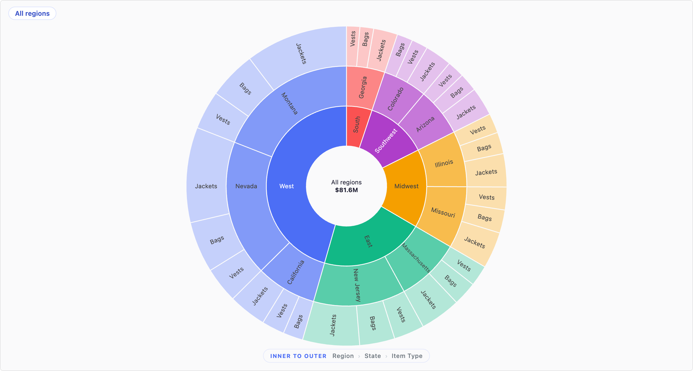

# Retail apparel sunburst — Plotly, mode C

Three-ring sunburst: **region > state > item type**, wedges sized by summed
`Total sales`, grand total on the centre disk. Click a wedge to zoom into that
branch; click a breadcrumb crumb to come back out.



Built against the `(Sample) Retail - Apparel` model, but the hierarchy is not
hard-coded to geography — point `COL_L1/L2/L3` at any three dimensions in the
`Customize` block and the rings follow.

## Why this is the sunburst to copy

It is the only example here taken through the preview loop **and** the emit
checklist. `examples/Sunburst-chart/` and `examples/NWP-sunburst/` show the same
hierarchy technique but predate both, and carry four defects this one fixes:

| Defect | What it costs | Fixed here by |
|---|---|---|
| `<!DOCTYPE html><html><head>` wrapper | Hard-rule violation — the host wraps your HTML | `chart.html` is bare markup plus the one CDN `<script src>`, which is where the host wants it |
| `String(r[i])` with no cell unwrapping | Object-wrapped cells become `[object Object]`; every wedge collapses into one | `cellVal()` on every read |
| `emitRenderCompletedEvent()` on the success path only | A tile that throws blocks the Liveboard PDF export for the whole board | `signalRenderComplete()` — once, on success, on failure, and on a watchdog |
| Unbounded CDN injection, no `ResizeObserver` | Renders perfectly in preview, then hangs or clips in ThoughtSpot | 12s timeout + second CDN host; `ResizeObserver` on the container |

## The three that only showed up after paste

This chart shipped once and did not render on the tile. Nothing was wrong with the
chart — the preview had quietly supplied three things a tile does not, and the skill
has since been changed so none of them can pass again.

**The height chain was never completed.** A percentage height resolves only against
an ancestor chain that is definite the whole way up, and a tile's `<body>` has no
height of its own. `#chart { height: 100% }` collapsed to the breadcrumb — 52px
measured — with the sunburst stage at 0px inside it. `emitRenderCompletedEvent()`
fired, the console was clean, and the tile was blank. `html, body { height: 100% }`
is now in `chart.css` and is load-bearing, not boilerplate. The preview page no
longer sets it, and `snap.mjs` prints a `height-chain:` verdict.

**`chart.js` read `globalThis.viz`.** The documented entry point is the bare `viz`
identifier. Where a host scopes it to the wrapper it runs the JS tab in, the global
is undefined and the chart fails in two directions at once: it falls back to the
baked-in sample rows, *and* `emitRenderCompletedEvent()` throws into an empty catch
so the tile never reports in — which is exactly the state the host paints as "Chart
did not render". `getViz()` now resolves through both shapes, and the emit failure
warns instead of being swallowed. The preview passes `viz` as an argument and
deliberately publishes no global.

**Plotly loaded only by dynamic injection.** The host's documented shape for a CDN
library is a `<script src>` in the HTML tab. Both paths are present now; `chart.js`
polls for an in-flight tag before injecting a second copy.

## The two failures worth understanding

**A hanging CDN is not a blocked CDN.** A blocked host fires `onerror`. A host
that hangs fires neither event, so an unbounded `await new Promise(...)` never
settles — `emitRenderCompletedEvent()` never fires and ThoughtSpot shows a bare
*"Chart did not render"* over an empty tile with nothing useful in the console.
`injectScript()` is bounded and tries `cdn.plot.ly` then `cdn.jsdelivr.net`. If
both fail you get a red panel naming each URL instead of the host's placeholder.

**`responsive: true` is not enough.** Plotly listens to `window.resize` only, but
a Liveboard tile resizes while the window does not. Measured, resizing the
container:

```
with a ResizeObserver:  stage=596x648  svg=596x648   fits
without:                stage=596x648  svg=1222x616  overflows
```

## Mount points

`ensureMount()` builds `#chart / #breadcrumb / #sunburst` if they are not already
in the DOM, so the JS tab renders on its own. Verified by emptying `chart.html`
and re-snapping — the chart still draws. Without that, a host that evaluates the
JS before the HTML tab lands gives you a blank tile and no error, because the
`catch` guard `if (stageEl)` skips painting through the very element that was
null.

## Data mode

`DATA_MODE = 'auto'` (mode C): live rows when a search is attached, the baked-in
sample rows when not, with a `SAMPLE DATA` badge so nobody mistakes one for the
other. `'live'` suppresses the fallback and shows *"No rows returned by the
search"*; `'sample'` ignores the search entirely.

The sample rows are 30 representative rows across 5 regions — plausible shape and
relative magnitude, not a faithful aggregation of any particular extract.

## Verified in preview

Against the skill's `viz` stub, not a live cluster.

| Check | Result |
|---|---|
| `--data live` | renders, no console errors, render-complete fired |
| `--data absent` | sample rows + badge |
| `--data wrapped` | object cells unwrapped, identical to live |
| `--data empty` (auto / live) | sample + badge / "No rows returned by the search" |
| `--data noviz` | renders from baked-in rows, nothing throws |
| `height-chain:` | `ok` — 668px sized, 720px with the preview's wrappers removed |
| `viz` as an argument, no global | live rows still resolve, render-complete fires |
| container resize 620x700, 1180x420, 900x900 | svg fits the container at every size, 92 slice paths retained |
| empty `chart.html` | still renders — mount points rebuilt, dynamic CDN loader used |
| both CDNs unreachable | red panel naming each URL, not a blank tile |
| click wedge / crumb | 46 -> 13 -> 46 nodes, breadcrumb follows |

Regression-checked in both directions: reverting `chart.css` to the shipped version
makes the harness report `height-chain: BROKEN - #chart is 668px here but collapses
to 52px`, and reverting `chart.js` to `globalThis.viz` makes it show the SAMPLE DATA
badge under `--data live` and warn that render-complete never fired.
