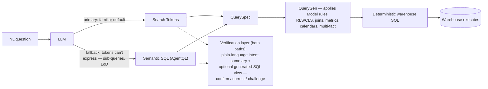

# Why AgentQL — the architecture, and what it buys you over raw DB SQL

AgentQL looks like SQL, but it is **not** the SQL that runs against your warehouse. This
file explains what actually executes, why that design exists, and the trust/correctness
guarantees it gives you that hand-written database SQL cannot. Read it when someone asks
"what's the point of AgentQL?", "why not just send SQL to the warehouse?", or "is this
safe to trust?".

> One-line version: **The LLM's (or your) AgentQL is treated as *intent*. ThoughtSpot
> compiles it into deterministic warehouse SQL that honours every rule codified in the
> Model — and only that compiled SQL is ever executed.**

---

## The core principle: ThoughtSpot does not execute AgentQL

ThoughtSpot never runs the AgentQL statement against the database. The flow is:

```
AgentQL  ──►  ThoughtSpot QueryGen  ──►  warehouse SQL  ──►  warehouse executes
(intent)     (applies the Model's        (deterministic,
              semantic rules)             governed)
```

The AgentQL is parsed into a **QuerySpec** and handed to ThoughtSpot's **Query Generation**
engine — the *same* engine that powers Liveboards, Answers, Search and Spotter. QueryGen
emits the actual warehouse SQL, applying every rule built into the Model. That compiled SQL
is what `generate-sql` returns and what `fetch-data` executes.

**Why this matters:** the statement an LLM writes can be wrong, unsafe, or hallucinated —
but it is never executed. It only describes *what to answer*; ThoughtSpot decides *how*,
deterministically, against governed definitions. There is no path by which arbitrary
LLM-authored SQL reaches the warehouse.

---

## What the semantic layer guarantees (rules AgentQL respects, raw SQL doesn't)

These rules live in the Model. Because QueryGen — not the LLM — writes the executed SQL,
**every one is enforced automatically**, on every query, with no way to bypass them:

| Rule | What QueryGen enforces | Why raw DB SQL can't guarantee it |
|---|---|---|
| **Data security — Row-Level (RLS)** | Row filters for the querying user are injected into the generated SQL | Hand-written SQL sees all rows unless the author manually re-implements every RLS rule |
| **Data security — Column-Level (CLS)** | Restricted columns are unavailable to the user; the query can't select them | Raw SQL can select any physical column the connection can reach |
| **Model semantics — model-level filters** | Always-on Model filters are applied to every query | A SQL author must remember to add them every time |
| **Model semantics — join definitions** | The Model's declared joins (type, cardinality, path) are used | Raw SQL picks its own joins — easy to choose the wrong path or cardinality |
| **KPI / metric definitions** | Level-of-detail (LOD) calcs, semi-additive measures, and other governed metric logic are computed the way the Model defines them, so results are correct | Each SQL author re-derives the metric and they drift apart |
| **Custom calendars** | Client-defined calendars (4-4-5, fiscal/monthly offset, etc.) drive period logic, so "this year vs last year" lands on the right period boundaries | Calendar logic must be hand-coded into every query and kept in sync |
| **Complex data modelling** | Multi-fact **chasm traps** and **fan traps** are resolved by the engine (correct aggregation across fact tables, no fan-out double counting) | Naïve joins across multiple facts silently inflate measures — one of the most common hand-SQL correctness bugs |

The chasm/fan-trap and semi-additive cases are the headline: these are exactly the queries
where competent engineers writing raw SQL get **wrong numbers that look plausible**.
QueryGen gets them right by construction.

---

## Architecture advantages over raw DB SQL

Beyond the per-rule guarantees above, the architecture itself buys you:

- **No hallucinated query is ever executed.** The LLM produces *intent*; the deterministic
  engine produces the *executed* SQL. Wrong intent yields a wrong-but-governed answer or a
  validation error — never an ungoverned query against your data.
- **Determinism & traceability.** The same question compiles to the same QuerySpec → the
  same warehouse SQL → the same numbers, regardless of which LLM produced the AgentQL or how
  it phrased it. You can inspect the generated SQL (`generate-sql`) and audit exactly what ran.
- **Consistency with the rest of ThoughtSpot.** Because AgentQL rides the same QueryGen as
  Liveboards/Answers/Search/Spotter, an AgentQL result *matches* what a pinned Liveboard shows.
  There are no divergent "shadow metrics" defined in ad-hoc SQL drifting from the governed ones.
- **Physical-layer abstraction & dialect portability.** AgentQL references the **Model**
  (business names), not physical tables/columns. Warehouse refactors, renames, and
  repartitioning don't break it, and the same AgentQL compiles to the target warehouse's
  dialect (Snowflake / Databricks / BigQuery / …).
- **Single point of change.** Fix a definition once in the Model and every AgentQL query
  inherits it. Raw SQL embeds the logic in each query, so a definition change means hunting
  down and editing every copy.
- **Governed scale.** End-to-end governance is enforced while scaling to large row counts;
  access controls also gate *which* Models a user can query at all (and non-CDW Models are
  rejected outright — see `limitations.md` / the SKILL.md requirement note).

---

## Where AgentQL sits in the Spotter NL architecture

AgentQL is the **expressibility fallback** in a hybrid natural-language flow. Both paths end
in the same deterministic, governed QueryGen step — the difference is only how the user's
intent is captured.



<!-- Plain-text fallback for contexts that don't render Mermaid (terminal, agent reads, grep). -->

```
                          ┌─────────────────────────────────────────┐
  NL question ──► LLM ──►  │  Path A (primary): Search Tokens         │ ─┐
                          │     → familiar, default path              │  │
                          ├─────────────────────────────────────────┤  ├─► QuerySpec ─► QueryGen ─► deterministic
                          │  Path B (fallback): Semantic SQL (AgentQL) │  │   (Model rules)   warehouse SQL ─► execute
                          │     → when tokens can't express the       │ ─┘
                          │       question (sub-queries, LoD, etc.)   │
                          └─────────────────────────────────────────┘
                                          │
                                          ▼
                            Verification layer (unified across
                            BOTH paths): plain-language intent
                            summary + optional generated-SQL view
                            → user can confirm / correct / challenge

  The LLM output — tokens OR AgentQL — is INTENT. It is never executed directly.
  QueryGen produces and runs the SQL, with all Model rules (RLS/CLS, joins, metrics,
  calendars, multi-fact resolution) applied. Verifiability holds on both paths.
```

**Why a hybrid, not AgentQL-only:** Token-based Answers and AgentQL **co-exist** — AgentQL is
not a replacement. Token-based Answers stay the primary path: they are familiar and carry
the verification experience users already trust, letting a business user confirm or correct
how Spotter interpreted their intent before acting. AgentQL is the **expressibility fallback**,
taken when the token grammar can't express the question. It closes two gaps in the
token-only approach:

- **Spotter training lag.** Tokenised answers require Spotter to be trained to emit
  syntactically valid TML for each analytical feature; new Search Data capabilities (e.g.
  Sets, LoD formulas) lag behind in Spotter. AgentQL decouples *expressibility* from that
  training cycle — if Search Data can answer it, AgentQL can express it now.
- **Analytical gaps.** Some questions Search Data can answer aren't reachable through the
  token grammar but are straightforward to state in SQL.

Crucially, the trust story is preserved either way: **at no stage is the LLM's SQL executed.**
All answers run deterministic SQL generated on the semantic Model, so codified rules like RLS
are always applied and results are not hallucinations.

---

## Preserving trust as expressibility grows — AgentQL Verification

Determinism (above) guarantees the *executed SQL* is governed and reproducible. It does **not**
guarantee the user knows ThoughtSpot understood their *question* — and that interpretability is
what has made ThoughtSpot uniquely trustworthy. With Token-based Answers, the search tokens
themselves are the verification layer: a business user can read and correct them without knowing
SQL. AgentQL raises the accuracy ceiling, but a more expressive query is harder to eyeball — and
left unaddressed, an AgentQL answer risks becoming a "black box" indistinguishable from the opaque
AI outputs competitors ship.

The mitigation is a **verification layer unified across both transformers**, so users get one
consistent standard of verifiability *regardless of whether an answer was produced by tokens or
AgentQL*. The principle is co-existence **and parity** — verification is not a token-only feature
the AgentQL path quietly loses. It lets users **confirm, correct, or challenge** how the AI
interpreted intent, surfaced at the altitude each persona needs:

| Persona | Need | What verification surfaces |
|---|---|---|
| **Business user** (Finance Director, Sales Manager) | Confidence — "did it read my question right?" | A plain-language **intent summary** (interpreted filters, columns, date ranges). Zero training, no SQL required. |
| **Data analyst** (model owner) | Transparency — structural correctness | A **developer mode** to inspect the generated SQL against the semantic model, catching wrong join paths or aggregation-grain issues before publishing. |
| **Developer / embedder** | Configurable integrity | Control over which verification elements are shown or hidden on embedded surfaces (full detail → plain-language summary only). |

**Why this is the moat, not a footnote.** Human-in-the-loop verification is ThoughtSpot's core
differentiator against black-box LLM search. Extending AgentQL *without* extending verification
would regress Spotter to the standard LLM baseline and erode the accuracy advantage. With it, the
competitive narrative shifts from *"will the AI be accurate?"* to *"how easily can you verify the
AI's accuracy?"* — and the **verifiable-by-anyone** guarantee holds even as AgentQL widens what
Spotter can answer.

> **Scope note:** the verification layer is being built for the **ad-hoc Spotter conversational
> flow** first. Pinnable AgentQL Answers, full Edit-Answer functionality, and verification of
> already-pinned answers (Liveboards) are deferred to later phases — see the AgentQL Verification
> and Pinnability PRDs.

---

## Business value (why this pathway exists)

| Value | Description |
|---|---|
| **Wider Spotter capability** | Answers a substantially wider range of complex analytical questions, closing the expressibility gap of the token-only path. |
| **Reduced training / maintenance** | Less burden constantly training Spotter to emit syntactically specific TML; the LLM focuses on generic, correct SQL. |
| **No expressibility lag** | New Search Data features (e.g. Sets) become expressible immediately, decoupled from the Spotter-training cycle. |
| **Better UX** | Faster, more intuitive access to complex insights without users needing to understand data-model nuances — driving adoption. |

---

## Related

- `agentql-rules.md` — the dialect constraints that make a statement valid (the *how*).
- `limitations.md` — what AgentQL can't express today (the boundary of the expressibility gap).
- `integration.md` — calling the deterministic `generate-sql` / `fetch-data` endpoints directly.
